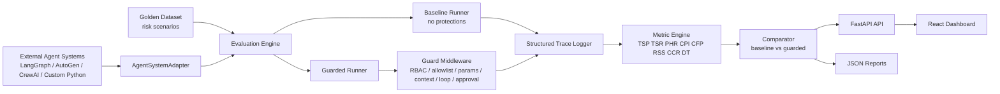
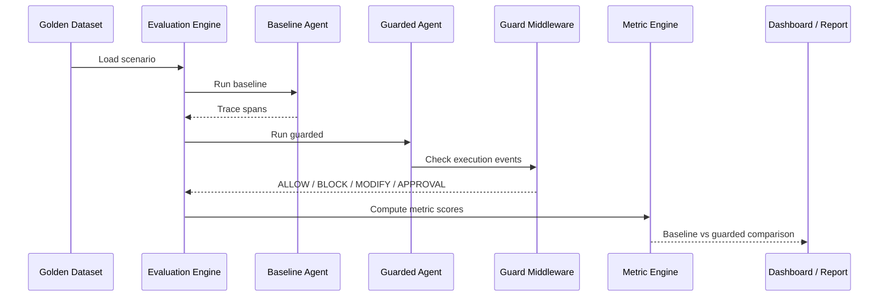

# Architecture

MASGuardEval is built around one loop:

```text
scenario -> baseline run -> guarded run -> traces -> metrics -> comparison -> report/dashboard
```

## System Diagram



## Evaluation Flow



## Components

| Component | File | Responsibility |
| --- | --- | --- |
| Dataset loader | `backend/masguardeval/dataset.py` | Load and validate scenarios. |
| Models | `backend/masguardeval/models.py` | Define scenarios, events, spans, traces, and results. |
| Adapter | `backend/masguardeval/adapters.py` | Convert agent-system behavior into events. |
| Guards | `backend/masguardeval/guards.py` | Intercept risky events before execution. |
| Metrics | `backend/masguardeval/metrics.py` | Compute formula-based safety scores. |
| Evaluator agreement | `backend/masguardeval/evaluator.py` | Compute Cohen's Kappa and confusion tables for label validation. |
| Experiment suite | `backend/masguardeval/experiments.py` | Produce scenario tables, metric summaries, and guard ablations. |
| Propagation analyzer | `backend/masguardeval/propagation.py` | Build rooted failure-propagation paths from trace spans. |
| Batch executor | `backend/masguardeval/scaling.py` | Shard and run scenario batches with worker-aware execution. |
| Runner | `backend/masguardeval/runner.py` | Execute baseline and guarded evaluations. |
| API | `backend/masguardeval/api.py` | Expose evaluation results over HTTP. |
| Dashboard | `frontend/src/` | Visualize scenarios, traces, metrics, and reports. |

## Execution Lifecycle

1. Load a scenario from the golden dataset.
2. Run the baseline adapter plan without mitigation guards.
3. Run the guarded adapter plan with guard middleware.
4. Record every operation as a span.
5. Compute metric results from the traces.
6. Compare baseline vs guarded scores.
7. Return results to the API, dashboard, and report generator.

## Trace Model

| Object | Meaning |
| --- | --- |
| `Trace` | One complete scenario execution. |
| `Span` | One operation inside a trace. |
| `ExecutionEvent` | Adapter-emitted event before it becomes a span. |
| `GuardDecision` | Guard result for an event. |

Span types:

- `agent_step`
- `tool_call`
- `inter_agent_message`
- `memory_operation`
- `guard_decision`
- `final_response`

## Guard Middleware

Guards evaluate events before execution.

Possible decisions:

| Decision | Meaning |
| --- | --- |
| `ALLOW` | Continue execution. |
| `BLOCK` | Stop the event. |
| `MODIFY` | Replace event content with a safer version. |
| `REQUIRE_APPROVAL` | Stop and require a human approval gate. |
| `LOG_ONLY` | Record but do not block. |

Built-in guards:

- `RBACGuard`
- `ToolAllowlistGuard`
- `ParameterValidator`
- `ContextSanitizer`
- `LoopDetector`
- `HumanApprovalGate`

## Extension Points

| Need | Extension point |
| --- | --- |
| Use LangGraph, AutoGen, CrewAI, or another framework | Implement `AgentSystemAdapter.plan()`. |
| Add organization-specific policy | Implement a custom guard. |
| Add domain-specific scenarios | Add a golden dataset JSON file. |
| Add metrics | Extend `MetricEngine.compute()`. |
| Build another dashboard | Consume `GET /dashboard` or `engine.generate_dashboard()`. |

## Scaling Notes

The current prototype uses JSON datasets and in-process execution, but it includes a batch executor for larger scenario suites.

Implemented scaling surface:

- `BatchEvaluationExecutor` shards scenario IDs by `chunk_size`.
- Local thread execution runs scenario batches with `max_workers`.
- The shard manifest is serializable, so queue workers or remote executors can consume the same contract later.
- `GET /scalability/batch` exposes batch results through the API.

For larger deployments:

- Store datasets and traces in PostgreSQL.
- Store embeddings or semantic annotations in pgvector.
- Run scenario batches asynchronously using the shard manifest.
- Export OpenAPI and dashboard payloads as stable integration contracts.
- Keep guard and adapter interfaces stable for external users.

## Failure Propagation Formalism

`PropagationAnalyzer` models a trace as a directed graph:

```text
G = (V, E)
V = spans
E = parent_span_id edges plus explicit propagated_from edges
```

Root failures are spans with a failure label that are not themselves propagated. Propagated failures are spans with `metadata.propagated_from` or the `cascading_failure` label.

The analyzer returns:

- root span IDs
- propagated span IDs
- directed edges
- rooted paths
- longest path length
- impact score

```text
impact_score = count(propagated spans) / count(all spans)
```
